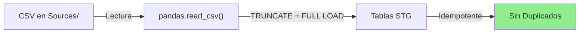
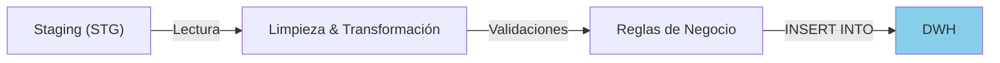
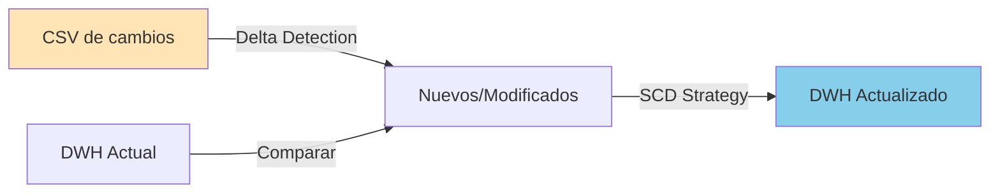

# ADE2026 - TP2: ETL Universidad

## 📋 Descripción General

Sistema de **Extracción, Transformación y Carga (ETL)** para un Data Warehouse de una Universidad. Este proyecto implementa un flujo completo de carga inicial de datos y transformación, con estructura preparada para futuras cargas incrementales.

---

## 📁 Disposición de Archivos

```
TP2/
├── logging_config.py                 # Módulo centralizado de logging para ETL
├── LOGGING_README.md                 # Documentación del sistema de logging
├── README.md                         # Este archivo - Guía del proyecto
├── requirements.txt                  # Dependencias Python (pandas, sqlalchemy, etc.)
│
├── .env                              # Variables de entorno (NO versionado)
├── .env.ex                           # Template de variables de entorno
│
├── 1-ScriptCreación_UniversidadDWH/
│   └── CreacionDWH_Universidad.sql   # Script SQL para crear DW
│
├── 2-ScriptCreación_UniversidadSTG/
│   └── CreacionSTG_Universidad.sql   # Script SQL para crear Staging
│
├── 2-ETL_CargaInicial/               # Carga inicial (Full Load)
│   ├── carga_staging.py              # [✅] Carga inicial desde CSV a Staging
│   ├── transformacion.py             # [✅] Transformación de Staging a DWH
│   ├── orquestador.py                # [✅] Orquestador principal de carga inicial
│   ├── logs/                         # Directorio de logs
│   │   ├── carga_staging_*.log
│   │   └── transformacion_*.log
│   └── README.md
│
├── 3-ETL_Incremental/                # Carga incremental (SCD y Deltas)
│   ├── carga_incremental.py          # [✅] Procesar e insertar cambios
│   ├── run_test.py                   # [✅] Simulador automatizado de pruebas
│   ├── test_data_incremental.sql     # Datos de test para incremental
│   ├── logs/                         # Directorio de logs
│   └── README.md
│
└── Sources/                          # Datos de entrada
    ├── ADE_TP2_Analisis_de_los_datos.ipynb
    ├── curso_programa.csv
    ├── curso.csv
    ├── departamento.csv
    ├── dictado.csv
    ├── docente.csv
    ├── estudiante.csv
    ├── evaluacion_curso.csv
    ├── examen.csv
    ├── facultad.csv
    ├── inscripcion.csv
    └── oltp_universidad_erd.html
```

---

## 🔄 Flujo ETL Actual

### **Fase 1: Inicialización de Bases de Datos**

1. **Crear Staging (`STG`)** - [Script 2]
   - Tablas de almacenamiento intermedio
   - Columnas con sufijo `_raw` (tipo VARCHAR)
   - Campos de auditoría: `archivo_origen`, `fecha_carga`

2. **Crear Data Warehouse (`DWH`)** - [Script 1]
   - Tablas dimensionales y de hechos
   - Tipos de datos correctos
   - Claves primarias y foráneas

### **Fase 2: Carga Inicial (3-ETL_CargaInicial)**

#### 📌 Paso 1: Carga Staging

**Notebook:** `3-ETL_CargaInicial/carga_staging.ipynb`



**Estrategia:** TRUNCATE + Full Load

- Borra datos previos de la tabla
- Carga datos completos y frescos
- Garantiza NO hay duplicados
- Seguro ejecutar múltiples veces (idempotente)

**Archivos procesados:**

- `estudiante.csv` → `stg_estudiante`
- `docente.csv` → `stg_docente`
- `dictado.csv` → `stg_dictado`
- `inscripcion.csv` → `stg_inscripcion`
- `examen.csv` → `stg_examen`
- `evaluacion_curso.csv` → `stg_evaluacion_curso`
- `facultad.csv` → `stg_facultad`
- `departamento.csv` → `stg_departamento`
- `programa.csv` → `stg_programa`
- `curso.csv` → `stg_curso`
- `curso_programa.csv` → `stg_curso_programa`

#### 📌 Paso 2: Transformación

**Notebook:** `3-ETL_CargaInicial/transformacion.ipynb`



**Procesos:**

1. **Lectura de Staging:** Extrae datos de tablas STG
2. **Limpieza:**
   - Eliminación de duplicados
   - Conversión de tipos de datos
   - Validación de rangos
3. **Transformación:**
   - Deduplicación
   - Creación de dimensiones
   - Cálculo de métricas
4. **Carga en DWH:** INSERT en tablas finales

---

## 🚀 Cómo Ejecutar

### **Preparación Inicial**

1. **Instalar dependencias:**

   ```bash
   pip install -r requirements.txt
   ```

2. **Configurar variables de entorno:**

   ```bash
   # Copiar template
   cp .env.ex .env

   # Editar .env con credenciales reales
   DB_USER=root
   DB_PASSWORD=tu_contraseña
   DB_HOST=localhost
   DB_PORT=3306
   STG_DATABASE=universidad_staging
   DW_DATABASE=universidad_dw
   ```

3. **Crear bases de datos SQL:**
   ```bash
   # Desde MySQL CLI o client
   mysql -u root -p < 2-ScriptCreación_UniversidadSTG/CreacionSTG_Universidad.sql
   mysql -u root -p < 1-ScriptCreación_UniversidadDWH/CreacionDWH_Universidad.sql
   ```

### **Ejecutar ETL Carga Inicial**

**Opción A: Carga Inicial (Full Load)**

Ejecuta el pipeline completo desde cero:
```bash
python 2-ETL_CargaInicial/orquestador.py
```

**Opción B: Carga Incremental**

Procesa únicamente los cambios nuevos detectados en Staging:
```bash
python 3-ETL_Incremental/carga_incremental.py
```

**Opción C: Simulador Automático de Carga Incremental**

Para pruebas, inserta datos simulados y corre el incremental cada 30 segundos:
```bash
python 3-ETL_Incremental/run_test.py
```

### **Visualizar Logs**

Los logs se generan automáticamente en:

```
3-ETL_CargaInicial/logs/
├── carga_staging_20260505_143022.log
└── transformacion_20260505_143515.log
```

**Ver logs en tiempo real:**

```bash
tail -f 3-ETL_CargaInicial/logs/carga_staging_*.log
```

---

## 📊 Sistema de Logging

Todos los procesos ETL usan un sistema centralizado de logging definido en `logging_config.py`.

### Características:

- ✅ Logs en archivo + consola simultáneamente
- ✅ Formato consistente: `YYYY-MM-DD HH:MM:SS - LEVEL - mensaje`
- ✅ Guardados en `3-ETL_CargaInicial/logs/` con timestamp
- ✅ Reutilizable en todos los notebooks
- ✅ Niveles: INFO, WARNING, ERROR, DEBUG

### Uso en código:

```python
from logging_config import LoggerManager

# Configurar al inicio
logger = LoggerManager.configurar("nombre_proceso",
                                 ruta_raiz=os.getcwd(),
                                 carpeta_logs='logs')

# Registrar eventos
LoggerManager.info("Iniciando carga")
LoggerManager.warning(f"Registros sin procesar: {count}")
LoggerManager.error(f"Error: {str(e)}")
```

Ver más en [LOGGING_README.md](./LOGGING_README.md)

---

## ⏳ Componentes Pendientes (Fase Actual)

### En `3-ETL_CargaInicial/`:

#### 1️⃣ **carga_dwh.ipynb** [⏳ TODO]

**Responsabilidad:** Carga incremental en el Data Warehouse

**Funcionalidad esperada:**

- Detectar registros nuevos vs. existentes
- Aplicar estrategia UPSERT (UPDATE/INSERT)
- Mantener integridad referencial
- Registrar cambios para auditoría

**Entrada:** Tablas STG (ya cargadas y transformadas)
**Salida:** Tablas DWH actualizadas

---

#### 2️⃣ **orquestador.ipynb** [⏳ TODO]

**Responsabilidad:** Orquestar todo el flujo ETL

**Funcionalidad esperada:**

- Ejecutar secuencialmente:
  1. Validación de fuentes de datos
  2. `carga_staging.ipynb` → Cargar CSV a Staging
  3. `transformacion.ipynb` → Transformar Staging a DWH
  4. Reporte de ejecución y estadísticas
- Manejo de errores y reintentos
- Generación de reporte consolidado
- Email/Notificación de éxito o fallo

**Flujo sugerido:**

```
[Inicio] → [Validar] → [Carga STG] → [Transformar] → [Reporte] → [Fin]
                           ↓            ↓                ↓
                      [Log OK/Error] [Log OK/Error] [Log Resumen]
```

---

## 🔮 Futura Fase: Carga Incremental (4-ETL_Incremental)

Esta fase se ejecutará periódicamente (diaria, semanal, etc.) para incorporar cambios sin reconstruir el DW completo.

### **Tareas Planificadas:**

#### 1. **Detectar cambios** (`detectar_cambios.ipynb`)

- Identificar nuevos registros desde última carga
- Identificar registros modificados
- Comparar timestamps o checksums
- Generar lista de registros delta

#### 2. **Carga Incremental** (`carga_incremental.ipynb`)

- Procesar solo registros nuevos/modificados
- Aplicar transformaciones delta
- Actualizar dimensiones (SCD Type 1, 2, o 3)
- Minimizar impacto en DW activo

#### 3. **Validación y Reconciliación**

- Verificar integridad de datos
- Comparar conteos antes/después
- Generar reporte de cambios
- Alertar de anomalías

### **Consideraciones de Diseño:**



**Estrategias de Dimensiones:**

- **SCD Type 1:** Sobrescribir (sin histórico)
- **SCD Type 2:** Agregar nuevo registro (con histórico)
- **SCD Type 3:** Agregar columna anterior (histórico limitado)

---

## 🔍 Validaciones y Calidad

### Verificaciones implementadas:

- ✅ Archivos CSV existen
- ✅ Tablas Staging/DWH existen
- ✅ Conexión a base de datos OK
- ✅ No hay duplicados en Staging (TRUNCATE)
- ✅ Tipos de datos correctos
- ✅ Registros vacíos detectados

### Métricas registradas:

- Cantidad de registros por tabla
- Tiempo de ejecución
- Errores detectados
- Advertencias (archivos vacíos, etc.)

---

## 📝 Convenciones de Código

### Nombres de tablas:

- **Staging:** `stg_<entidad>` (ej: `stg_estudiante`)
- **DWH:** `dim_<entidad>` o `fact_<entidad>` (ej: `dim_estudiante`, `fact_inscripcion`)

### Columnas Staging:

- Sufijo `_raw` en datos crudos (ej: `nombre_raw`, `edad_raw`)
- `archivo_origen` → nombre del CSV
- `fecha_carga` → timestamp de carga

### Variables de entorno (.env):

- `DB_USER` → Usuario MySQL
- `DB_PASSWORD` → Contraseña
- `DB_HOST` → Host (localhost)
- `DB_PORT` → Puerto (3306)
- `STG_DATABASE` → Base de datos Staging
- `DW_DATABASE` → Base de datos Data Warehouse

---

## 🆘 Troubleshooting

| Problema                              | Solución                                                                                    |
| ------------------------------------- | ------------------------------------------------------------------------------------------- |
| "ModuleNotFoundError: logging_config" | Verificar que `.env` existe con credenciales correctas                                      |
| "Connection refused"                  | Verificar que MySQL está corriendo y credenciales son correctas                             |
| "Table doesn't exist"                 | Ejecutar scripts de creación: `CreacionSTG_Universidad.sql` y `CreacionDWH_Universidad.sql` |
| Logs no se crean                      | Verificar permisos de escritura en carpeta `3-ETL_CargaInicial/`                            |
| CSV no encuentra                      | Verificar que archivos están en carpeta `Sources/`                                          |

---

## 📚 Recursos

- [Documentación de Logging](./LOGGING_README.md)
- [SQL Scripts](./1-ScriptCreación_UniversidadDWH/) - Creación de tablas
- [Data Sources](./Sources/) - Archivos CSV de entrada
- [Análisis Previo](./Sources/ADE_TP2_Analisis_de_los_datos.ipynb) - EDA

---

## ✅ Checklist de Implementación

### Fase 1: Carga Inicial [✅ COMPLETADA]

- [x] Scripts de creación de bases de datos
- [x] Carga de CSV a Staging
- [x] Transformación de Staging a DWH
- [x] Sistema centralizado de logging
- [x] Documentación

### Fase 2: Completar Carga Inicial [⏳ EN PROGRESO]

- [ ] `carga_dwh.ipynb` - Carga en DW
- [ ] `orquestador.ipynb` - Ejecutar flujo completo
- [ ] Validaciones adicionales
- [ ] Reporte de ejecución

### Fase 3: Carga Incremental [🔮 FUTURO]

- [ ] `detectar_cambios.ipynb` - Detectar delta
- [ ] `carga_incremental.ipynb` - Procesar cambios
- [ ] Estrategia de Dimensiones Lentamente Cambiantes
- [ ] Scheduling (Airflow/Cron)

---

## 📞 Contacto / Notas

- **Última actualización:** 5 de mayo de 2026
- **Estado del proyecto:** En desarrollo - Fase de Carga Inicial
- **Próximo hito:** Completar orquestador y carga incremental

---

**¡Comenzar a ejecutar ETL!** 🚀
